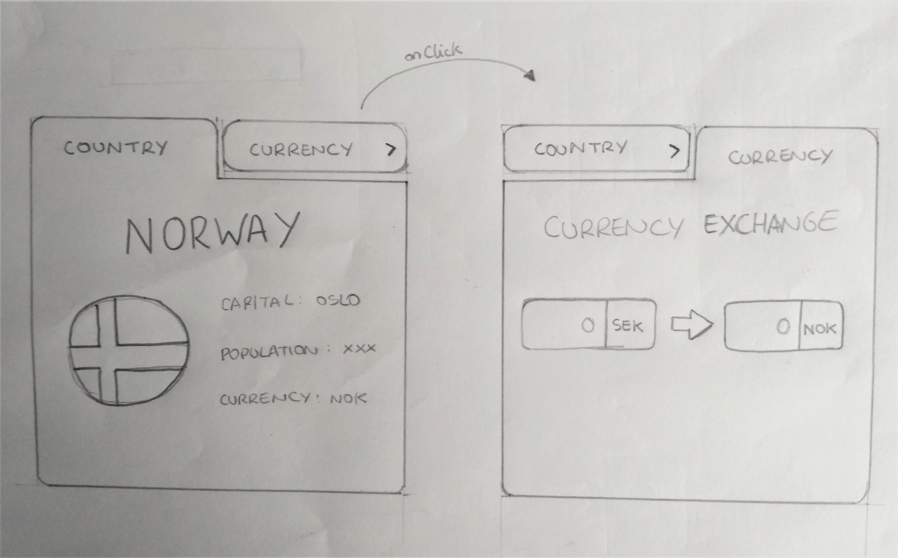

# Anyfin Assignment

Create a simple web interface using React which allows users to:

a) Search for countries and display its full country name, capital, population and currency. This can be a simple list, but you can also get creative in how to vizualize these data points.

b) Enter an amount in SEK and get the amount converted into local currency for each country.

## Functionality Planning

- Display a search box that takes the name of a country as input and makes a call to the restcountries API.

  > Use the search by country name function (it can be the native name or partial name) `https://restcountries.eu/rest/v2/name/{name}`

- Take the API response and display the country name, capital, population and currency.

  > You can filter the output of your request to include only the specified fields. `https://restcountries.eu/rest/v2/{service}?fields={field};{field};{field}`

  ```
  [[{
    "name": "Colombia",
    "capital": "Bogotá",
    "population": 48759958,
    "currencies": [{
      "code": "COP",
      "name": "Colombian peso",
      "symbol": "$"
    }]
  }]
  ```

- Display an input box next to the currency that takes an amount of SEK and makes a call to the Exchange Rate API.

  ```
  https://api.exchangeratesapi.io/latest
  ?base=SEK
  &symbols=COP      // ${this.state.countryDetails[0].currencies[0].code}
  ```

- Take the API response and display the amount of SEK translated to the local currency of the country.
  ```
  {
  "base": "SEK",
  "date": "2020-10-14",
  "rates": {
    "COP": 1.565
    }
  }
  ```

## Design Planning

The app will have two different components as featured in the mockup:

  - Country: user can input the desired country and it will render the name, flag, capital, population and currency. The button 'Currency' on the right top will bring the new component to the front, hiding country information.

  - Currency: user can input any amount of SEK and it will return the equivalence on the chosen country currency. The button 'Country' on the left top will bring the country component to the front, hiding the currency exchange.

Color Palette: Anyfin's corporate colors (#0A1668, #2C2D3A, #f5f5f5 and #ffeef2)



## Additional Features
- Use @media queries to handle responsiveness in smaller devices.
- Group HTML classes in the CSS file to avoid code repetition.
- Handle restcountries API response when it returns several countries to display just one at a time.
- Add loading animations when waiting for API responses.
- Add slower transition when changing between country and currency components.